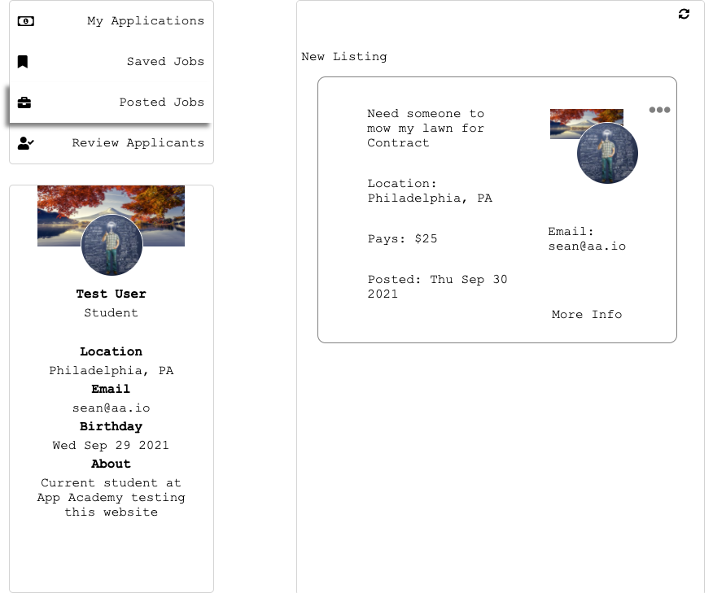
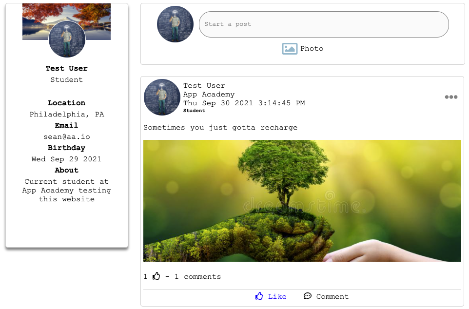
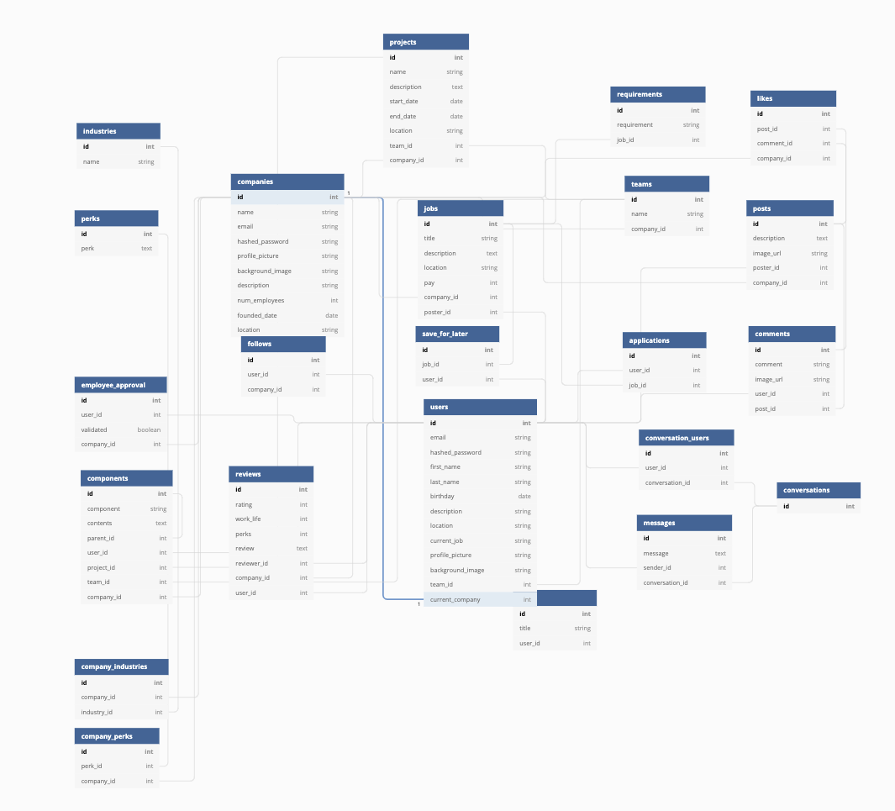

# WorkDay

# Table of Contents
1. [Technology Used](https://github.com/Cotter45/WorkDay-#Workday-was-built-with)

WorkDay is a modern day solution to those Craiglist ads we've all come to know and love. Here you can talk with your community and share jobs you've found or need help with. If you need a website built, or even someone to mow your lawn, it's super easy to connect with your community and find the right person for the job.  

Staying in touch is just as important so there's a community feed as the centerpiece of the site with options for liking and commenting to stay connected.

The live site is hosted on heroku, if no one's been there in a while it does take a minute to load, @ https://workday-app.herokuapp.com/ ! I'll be adding to the site regularly, there's a TON I still want to add, so be sure to stop by and report any bugs!

# WorkDay was built with
| | |
|---|---|
| | PostgreSQL |
| | NodeJS |
| | Express |
| | Sequelize |
| | React |
| | Redux |
| | HTML - CSS - Javascript |

## To set up locally

1. Download the zip file
2. Open with preferred editor
3. Use the command 'npm install' in a terminal for both the front-end and back-end sections, the back-end will run on port 5000 and the front-end will run on port 3000
4. Use the command 'npm start' for each folder, navigate to localhost 3000 to view the website, and localhost 5000 to make fetch calls to the api
5. Keep in mind this app uses JWT tokens for verification as well as csurf to prevent cross-site request forgery. Enjoy!

## Database Structure

Postgres/Sequelize

### To do at time of submission:
- I still have plans to add Company pages utilizing the user roles to display different information for employees of that company.
- These pages would be customizable, meaning a user with a superuser role would be able to add different preset, prestyle components to the pages in any order they'd like. Things like: to-do cards, charts, calendars, maps or notes
- I'd like to add a resume section to the users page as well as a photo album section
- I'd like to implement web sockets for messaging or live updates

### Some Things I Learned:
- I really learned how to set a pace during this project. There weren't many days I didn't finish a full crud operation from back to front. Of course the rest of the day was spent hunting new bugs... However I really managed to find my groove implementing features.
- I'm a person with great ambitions! I've always known this, however it can really interfere at times when I take on way too much. There are hundreds of lines of commented out code in this project for things I just didn't have the time to polish. I can't wait to slowly implement these as time goes on!
- During this project week I found a few people coming to me to ask questions, this was a first! I wasn't always able to help, but I found that taking the time away from my project and helping others for a few minutes with theirs was a major boost to my productivity as well as theirs. WIN WIN. It was a lot of fun to be working solo yet staying in touch with the whole team and working together to debug.

### Check out the wiki to see my documentation
- https://github.com/Cotter45/WorkDay-/wiki

### Some Screenshots

* Recorded Updating Profile

https://user-images.githubusercontent.com/80602015/135538185-6567ed9c-6251-4e58-9e6a-fbcc8fab9119.mov

